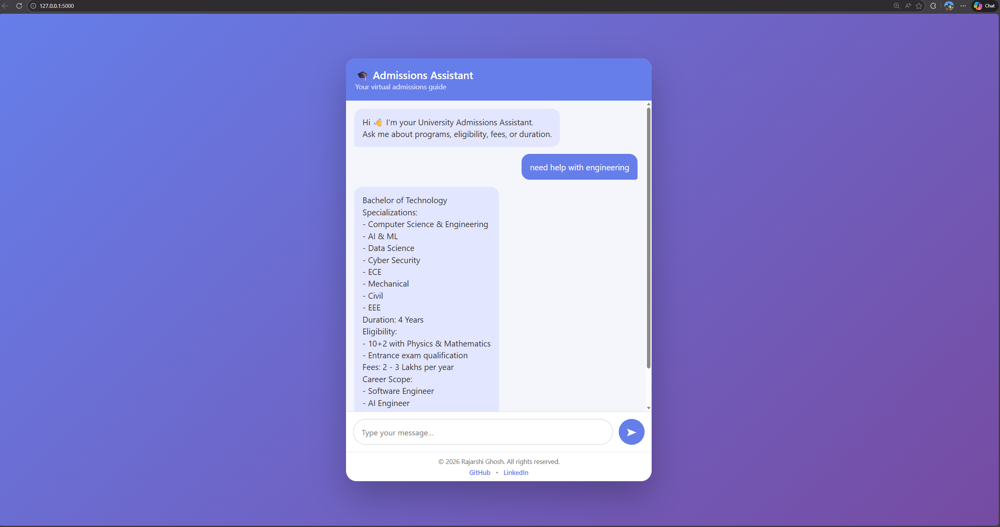

# University Admissions Assistant Chatbot

A data-driven, context-aware chatbot that helps students explore university academic programs, eligibility criteria, fees, entrance exams, specializations, and career scope through natural conversation.

The chatbot is designed to behave like a real admissions counselor rather than a rigid FAQ or menu-based system.


## Screenshot


## Project Overview

Students often struggle to navigate admission-related information due to fragmented program details, complex eligibility rules, and static help systems.

This project addresses that problem by providing an interactive admissions assistant that understands conversational queries and responds accurately using structured academic data.

All responses are generated strictly from a predefined knowledge base to ensure correctness and scalability.


## Key Features

### Context-Aware Conversation
- Remembers previously discussed schools and programs
- Supports follow-up questions without requiring repetition
- Enables natural conversational flow

### Fully Data-Driven Architecture
- Uses a single JSON file as the source of truth
- Eliminates hard-coded program logic
- Automatically supports new data fields without code changes
- Prevents incorrect or hallucinated responses

### Natural Language Interaction
- Handles conversational queries such as:
  - "engineering"
  - "career scope of btech"
  - "eligibility for architecture"
  - "specialization?"
- Supports abbreviations and informal phrasing

### Multi-Disciplinary Coverage
Supports programs across:
- Architecture
- Engineering
- Humanities and Social Sciences
- Law
- Management
- Pharmacy
- Science

### Responsive User Interface
- Chat-style interface with clear user and bot distinction
- Typing indicator for realistic interaction
- Responsive design optimized for mobile, tablet, laptop, and large screens


## Technology Stack

| Layer        | Technology            |
|-------------|------------------------|
| Backend     | Python, Flask          |
| Frontend    | HTML, CSS, JavaScript  |
| Data Storage| JSON                   |
| Architecture| Modular, Data-Driven   |


## Installation and Setup

### Clone the Repository
```bash
git clone https://github.com/itsrajarshi/university-admissions-bot.git
cd university-admissions-bot
``` 

### Install Dependencies
```bash
pip install flask
``` 

### Run the Application
```bash
python app.py
``` 

### Access the Application
Open the browser and navigate to:
http://127.0.0.1:5000


---

## Example Interactions

The chatbot supports realistic, multi-turn conversations similar to how students naturally ask admission-related questions.

---

### Example 1: Exploring Engineering

User:  
I want to know about engineering

Bot:  
Engineering primarily offers the Bachelor of Technology (B.Tech).  
It is a 4-year undergraduate program with multiple specializations.

User:  
What are the specializations?

Bot:  
B.Tech specializations include Computer Science and Engineering, AI and ML, Data Science, Cyber Security, ECE, Mechanical, Civil, and EEE.

User:  
What about eligibility?

Bot:  
To be eligible for B.Tech, students must have completed 10+2 with Physics and Mathematics and qualify through an entrance exam.

---

### Example 2: Architecture Admissions

User:  
Architecture

Bot:  
Architecture offers the Bachelor of Architecture (B.Arch) and Master of Architecture (M.Arch).

User:  
Tell me about B.Arch

Bot:  
B.Arch is a 5-year program requiring Mathematics in 10+2 and qualification in the NATA entrance exam.

User:  
Career scope?

Bot:  
Career options include Architect, Urban Designer, Interior Designer, and Landscape Architect.

---

### Example 3: Context Switching

User:  
career scope of btech

Bot:  
Career opportunities include Software Engineer, AI Engineer, Core Engineering roles, and Research positions.

User:  
What about MBA eligibility?

Bot:  
Candidates must have a bachelor’s degree and a valid management entrance exam score.

---

### Example 4: Minimal Input with Context Memory

User:  
arch

Bot:  
Bachelor of Architecture is a 5-year program with NATA as the entrance exam.

User:  
fees?

Bot:  
The total fee ranges between 14 and 15 Lakhs.


## Creative and Unique Feature

The chatbot retains conversational context and dynamically answers queries using a structured academic knowledge base, closely simulating a real university admissions counseling experience.


## Scalability and Extensibility

- New programs can be added by updating the JSON data file
- Additional fields such as scholarships, deadlines, or placements can be introduced without modifying chatbot logic
- The modular design supports future integration with NLP libraries or databases


## Limitations

- The chatbot responds only to information present in the knowledge base
- No user authentication or personalization
- Intended for academic and demonstration purposes


## License

This project is intended for academic and demonstration use.


## Author

Rajarshi Ghosh  
B.Tech – Computer Science and Engineering  

GitHub: https://github.com/itsrajarshi  
LinkedIn: https://linkedin.com/in/itsrajarshi
